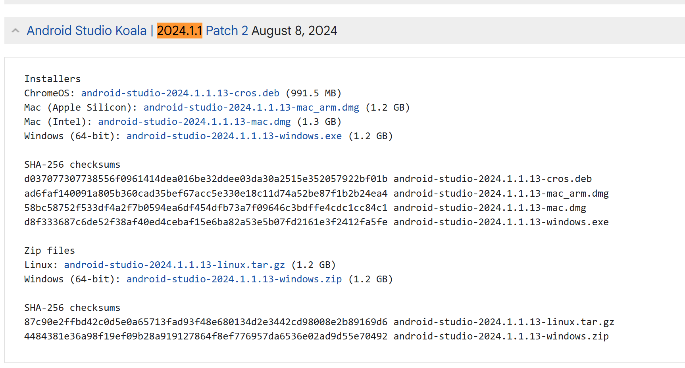
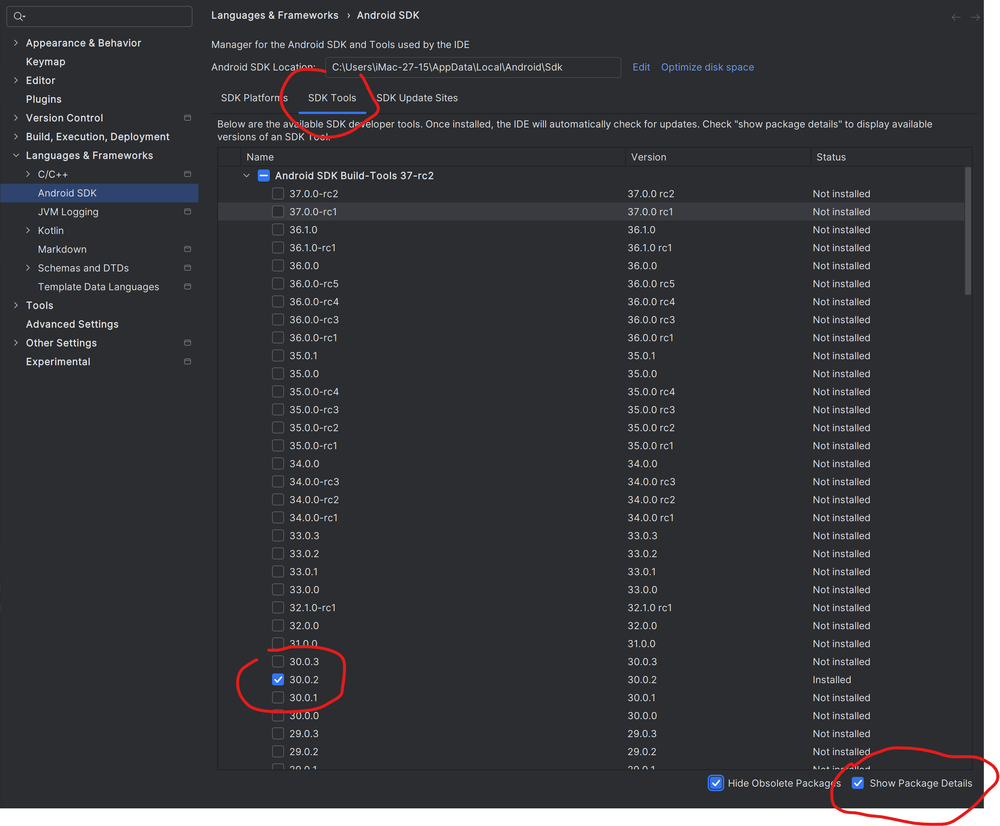
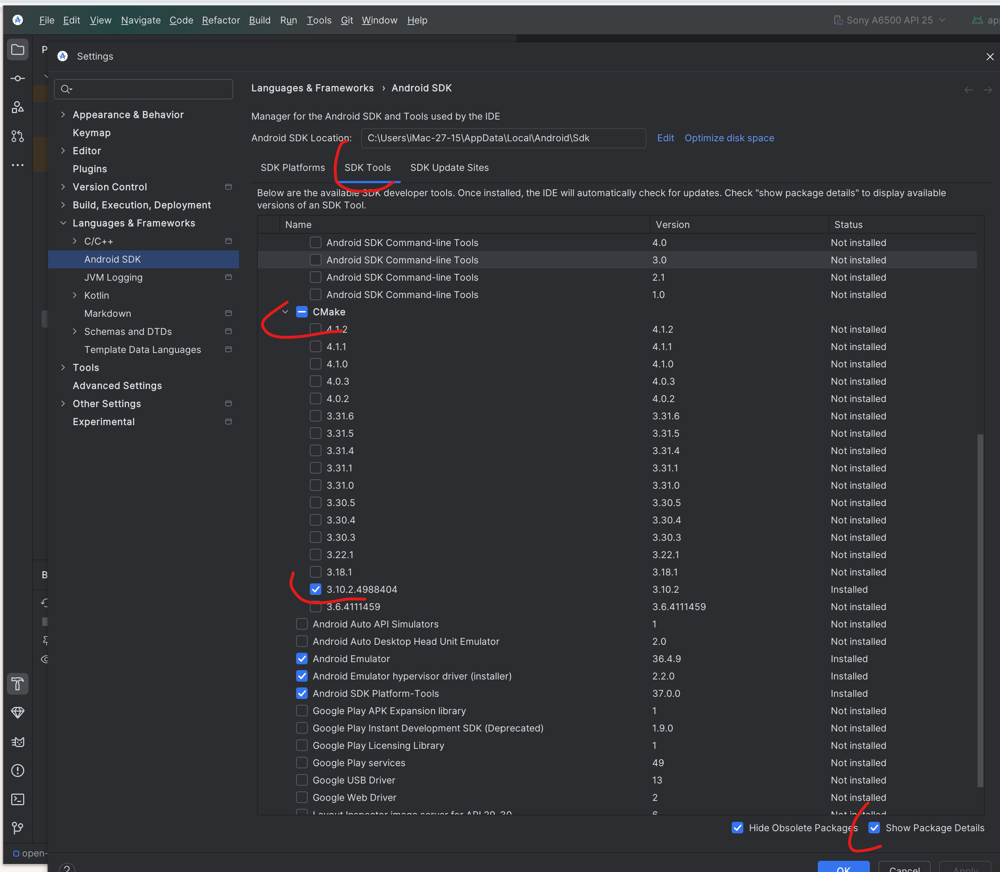
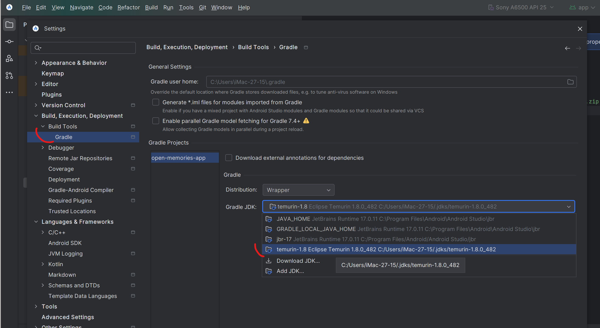
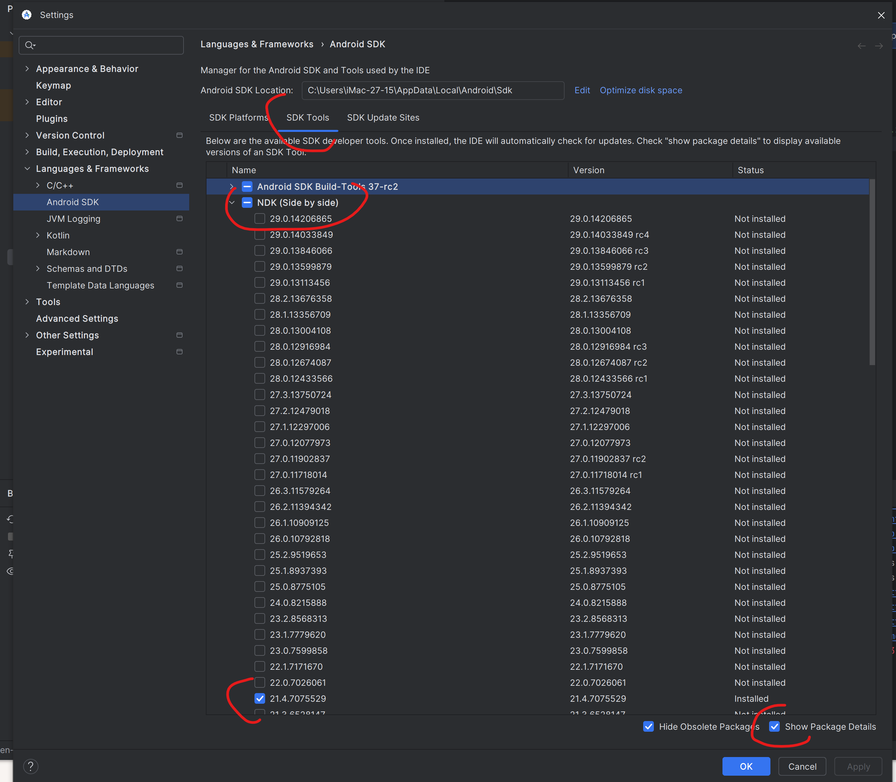
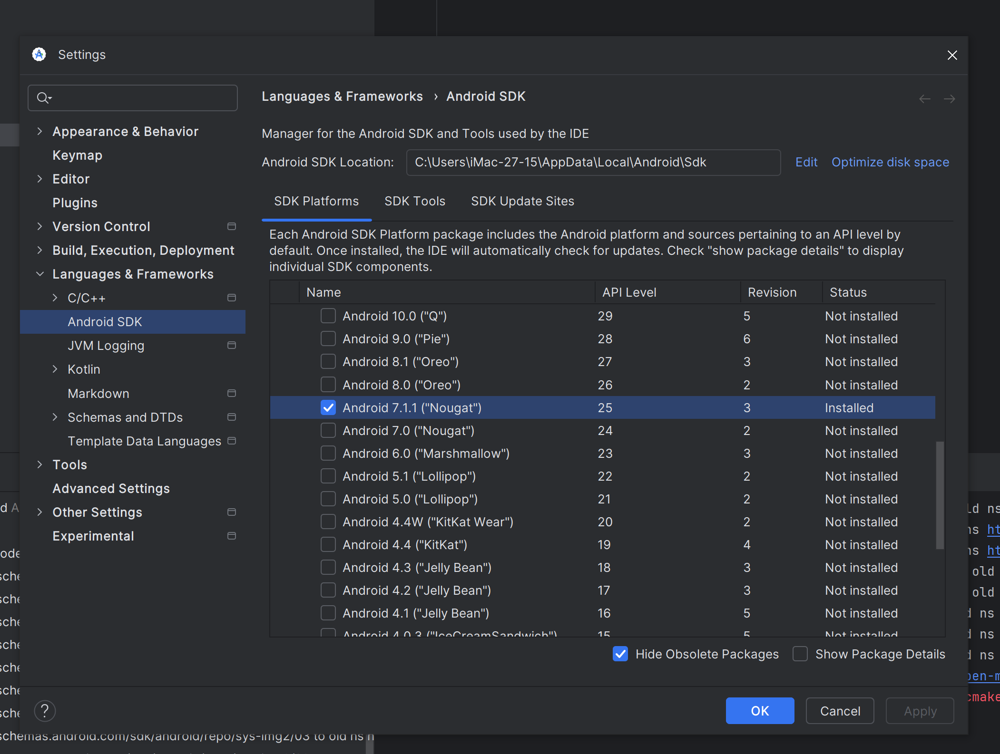
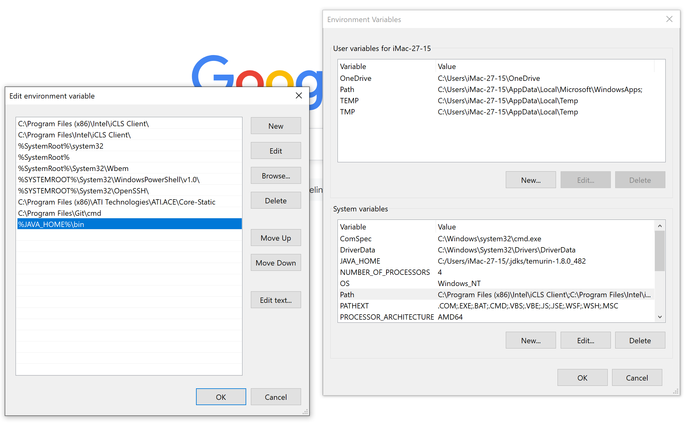
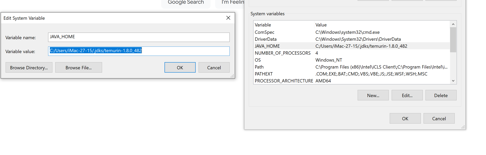

# Sony Open Memories App #
Experiment with Sony PlayMemories Android App by OpenMemories framework

## Requirements ##
- Android Studio 2024.1.1 https://developer.android.com/studio/archive
- Configure Android Studio > Gradle JDK as Temurin `1.8` - Java 8 `1.8.0_422`
- Using SDK 16 (Android 4.1) - compileSdkVersion 16
- Using NDK `21.4.7075529`
- Using Cmake `3.10.2`
- Using BuildTools `30.0.2`
- Test Device:
  - Run on Android 7.1.1 x86 API 25
  - Landscape - 3.0 inch - 640 x 480

`local.properties`

Replace `------USER------` with your windows account name
```
sdk.dir=C\:\\Users\\------USER------\\AppData\\Local\\Android\\Sdk
ndk.dir=C\:\\Users\\------USER------\\AppData\\Local\\Android\\Sdk\\ndk\\21.4.7075529
org.gradle.java.home=C\:\\Users\\------USER------\\.jdks\\temurin-1.8.0_482
```

## Build App ##
Set window global environment JAVA_HOME!
```bash
./gradlew build
```








